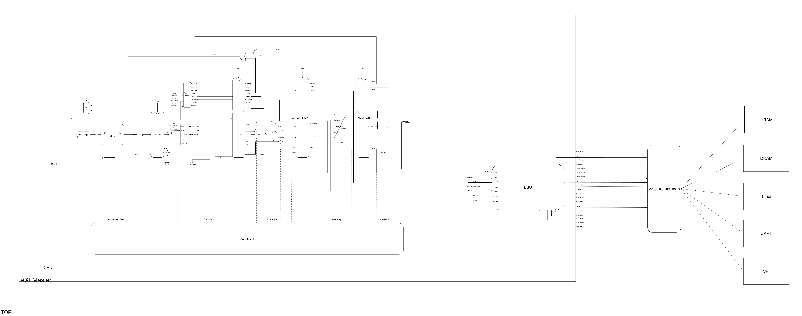

# System Overview

## Introduction

This project implements a small System-on-Chip (SoC) design with a pipelined CPU and AXI4-Lite interconnect for peripheral access. The design is organized around a central CPU core, memory subsystems, an on-chip interconnect, and peripheral modules for UART, SPI, and Timer functions.

## Architecture Summary

- SoC top-level module: `SoC/DUT/TOP.sv`
- CPU core module: `SoC/DUT/Master/CPU.sv`
- Control and datapath units: `SoC/DUT/CPU/ControlUnit.sv`, `SoC/DUT/CPU/ALU.sv`, `SoC/DUT/CPU/ALUControl.sv`, `SoC/DUT/CPU/MainDecoder.sv`
- AXI4-Lite interconnect: `SoC/DUT/AXI4_Lite_Interconnect.sv`
- Instruction and data RAM: `SoC/DUT/Slaves/RAM.sv`
- Peripheral modules: `SoC/DUT/Slaves/Timer.sv`, `SoC/DUT/Slaves/UART.sv`, `SoC/DUT/Slaves/SPI.sv`

## CPU Block Diagram



> Figure 1: CPU block diagram showing the main pipeline stages and control datapath.

## CPU Pipeline Design

The CPU implements a classic five-stage pipeline:

1. Instruction Fetch (IF)
2. Instruction Decode (ID)
3. Execution (EX)
4. Memory access (MEM)
5. Writeback (WB)

Key pipeline components:

- `pc_reg`: maintains the program counter and handles stall control
- `instr_mem`: fetches instructions from on-chip instruction memory
- `IF_ID`, `ID_EX`, `EX_MEM`, `MEM_WB`: pipeline registers separating stages
- `RegFile`: 32-bit register file for operand reads and writeback
- `signExtend`: immediate generation unit for instruction immediates
- `ControlUnit`: integrates the main decoder and ALU control logic
- `ALU`: performs arithmetic, logic, shift, and comparison operations

## Control and Datapath Behavior

The control unit decodes instruction fields:

- Opcode
- funct3
- funct7

It generates control signals for:

- register file write enable (`RegWrite`)
- ALU source selection (`ALUSrc`)
- memory write enable (`MemWrite`)
- jump/branch control (`Jump`, `Branch`)
- result source selection (`ResultSrc`)
- immediate format selection (`ImmSrc`)

The ALU supports standard arithmetic and logic operations:

- ADD, SUB
- AND, OR, XOR
- shift left logical (SLL)
- shift right logical (SRL)
- shift right arithmetic (SRA)
- set less than (SLT)

## SoC Interconnect and Slave Devices

The top-level SoC uses an AXI4-Lite interconnect with five slave interfaces:

- Slave 0: instruction RAM (`IRAM`)
- Slave 1: data RAM (`DRAM`)
- Slave 2: Timer peripheral
- Slave 3: UART peripheral
- Slave 4: SPI peripheral

The AXI4-Lite interconnect handles:

- address decoding
- read/write channel arbitration
- response signaling

## Memory and Peripheral Map

- `instr.mem`: initial program memory image for instruction fetch
- `RAM` modules are used for both instruction ROM and data RAM
- UART and SPI are exposed to the top-level physical IO for serial and SPI communication
- The Timer module is integrated as a memory-mapped peripheral

## Top-Level SoC I/O

The SoC top module exposes physical IO for:

- `uart_tx`, `uart_rx`
- `spi_sck`, `spi_mosi`, `spi_miso`, `spi_cs_n`

## Design Notes

- The CPU core is designed for a 32-bit RV32-style instruction set and supports a subset of RISC-V operations.

## Running the Project

To run this project, follow these steps:

1. Clone the repository from GitHub to your local machine:
   ```
   git clone https://github.com/VinhKhangDam/The-SoC-system-uses-RV32I-and-AXI4-buses.git
   cd The-SoC-system-uses-RV32I-and-AXI4-buses
   ```

2. Source the environment script to set up the necessary environment variables:
   ```
   source SoC/env.sh
   ```

3. Navigate to the SIM directory and run the Makefile to simulate the design:
   ```
   cd SIM
   make all test_name=TEST_NAME
   ```
- The design is modular and separates the processor datapath from the interconnect and peripheral wrappers.
- Pipeline forwarding and hazard handling are implemented to maintain instruction throughput and avoid data hazards.

