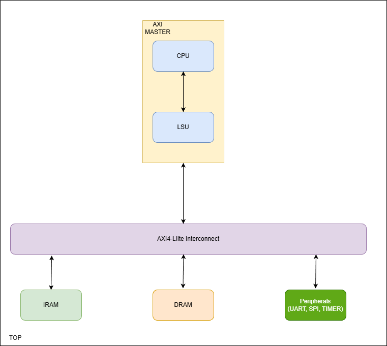
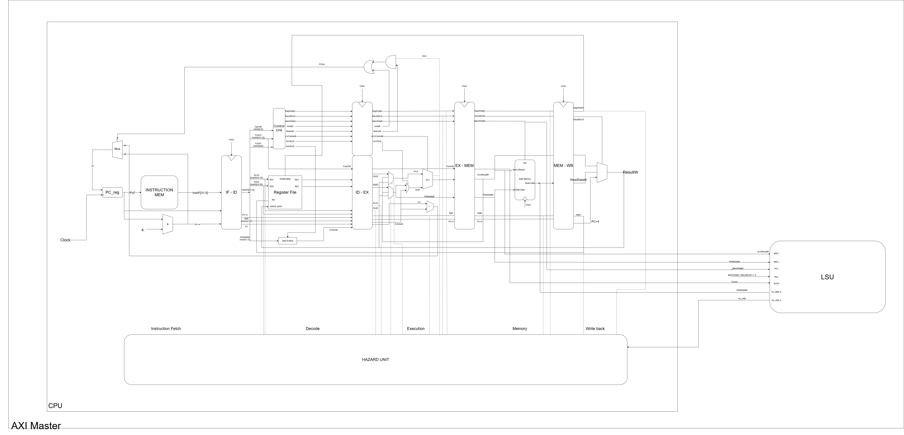
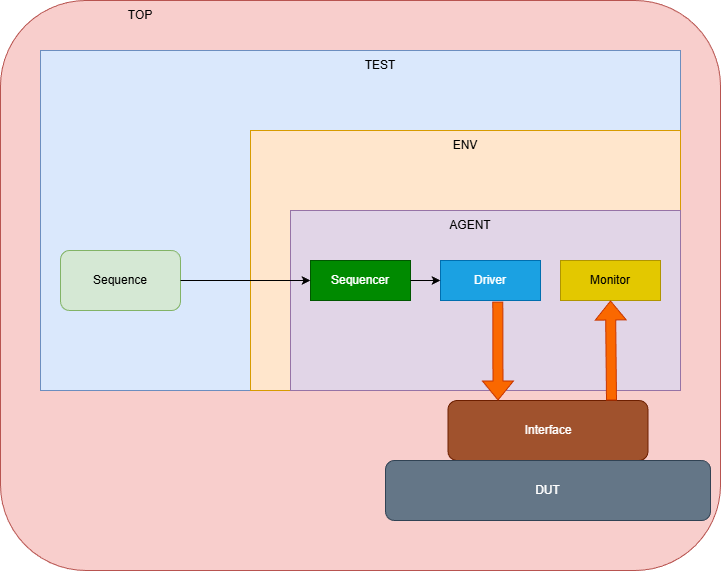

# RISC-V RV32I System-on-Chip (SoC) Design

[](https://opensource.org/licenses/MIT)
[](https://en.wikipedia.org/wiki/SystemVerilog)
[](https://en.wikipedia.org/wiki/Universal_Verification_Methodology)

A complete System-on-Chip (SoC) implementation featuring a pipelined RISC-V RV32I CPU core, AXI4-Lite interconnect, and integrated peripherals with comprehensive UVM-based verification.

## Table of Contents

- [Features](#features)
- [Architecture Overview](#architecture-overview)
- [Project Structure](#project-structure)
- [Prerequisites](#prerequisites)
- [Getting Started](#getting-started)
- [Verification](#verification)
- [Synthesis](#synthesis)
- [Contributing](#contributing)
- [License](#license)

## Features

### CPU Core
- **5-Stage Pipeline**: Instruction Fetch, Decode, Execute, Memory, Writeback
- **RV32I ISA Support**: Full 32-bit RISC-V integer instruction set
- **Hazard Handling**: Forwarding unit and stall logic for data hazards
- **ALU Operations**: ADD, SUB, AND, OR, XOR, SLT, SLL, SRL, SRA

### Interconnect & Peripherals
- **AXI4-Lite Bus**: Industry-standard on-chip interconnect
- **Memory Subsystem**: Separate instruction and data RAM
- **Integrated Peripherals**:
  - Timer with interrupt capability
  - UART for serial communication
  - SPI for peripheral interface

### Verification
- **UVM Framework**: Complete Universal Verification Methodology implementation
- **Coverage Analysis**: Branch, condition, and statement coverage
- **Randomized Testing**: Automated stimulus generation and scoreboard checking

### Synthesis
- **FPGA Ready**: Vivado project for Xilinx FPGA implementation
- **Timing Constraints**: 100MHz virtual clock configuration

## Architecture Overview

### TOP Block Diagram


### MASTER Block Diagram


### CPU Pipeline
```
Instruction Fetch → Instruction Decode → Execute → Memory Access → Writeback
       ↓                ↓              ↓          ↓            ↓
     PC Reg        Control Unit       ALU        LSU       RegFile
```

The CPU implements a classic five-stage pipeline where:
- **IF**: Fetches instruction from memory using program counter
- **ID**: Decodes instruction, reads registers, generates control signals
- **EX**: Performs ALU operations with forwarding for data hazards
- **MEM**: LSU handles load/store operations via AXI interconnect
- **WB**: Writes results back to register file

### Master Interface Architecture
The CPU and LSU together form the **AXI Master** component:
- **CPU Core**: Generates memory access requests (address, data, control signals)
- **Load-Store Unit (LSU)**: Translates CPU requests into AXI4-Lite protocol transactions
- **AXI Master Wrapper**: Combines CPU and LSU, providing the AXI interface to the interconnect

### Memory Map
- **Slave 0**: Instruction RAM (IRAM)
- **Slave 1**: Data RAM (DRAM)
- **Slave 2**: Timer Peripheral
- **Slave 3**: UART Peripheral
- **Slave 4**: SPI Peripheral

## Project Structure

```
.
├── DUT
│   ├── AXI4_Lite_Interconnect.sv
│   ├── AXI_Master.sv
│   ├── CPU
│   │   ├── ALU.sv
│   │   ├── ALUControl.sv
│   │   ├── ControlUnit.sv
│   │   ├── EX_MEM.sv
│   │   ├── HazardUnit.sv
│   │   ├── ID_EX.sv
│   │   ├── IF_ID.sv
│   │   ├── MEM_WB.sv
│   │   ├── MainDecoder.sv
│   │   ├── RegFile.sv
│   │   ├── data_mem.sv
│   │   ├── instr_mem.sv
│   │   ├── pc.sv
│   │   └── signExtend.sv
│   ├── Master
│   │   ├── CPU.sv
│   │   └── LSU.sv
│   ├── Slaves
│   │   ├── DRAM.sv
│   │   ├── IRAM.sv
│   │   ├── SPI.sv
│   │   ├── Timer.sv
│   │   └── UART.sv
│   └── TOP.sv
├── INF
│   ├── clk_rst_inf.sv
│   ├── cpu_monitor_inf.sv
│   └── soc_inf.sv
├── SIM
│   ├── Makefile
│   ├── compile_axi_multi_slaves_test.log
│   ├── compile_axi_random_wr_rd_test.log
│   ├── compile_axi_read_test.log
│   ├── compile_axi_write_test.log
│   ├── compile_cpu_test.log
│   ├── gen_mem.py
│   ├── instr.mem
│   ├── sim_axi_multi_slaves_test.log
│   ├── sim_axi_random_wr_rd_test.log
│   ├── sim_axi_read_test.log
│   ├── sim_axi_write_test.log
│   ├── sim_cpu_test.log
│   └── sim_expected.py
├── VERIFICATION
│   ├── Agent
│   │   ├── axi_agent.sv
│   │   └── cpu_agent.sv
│   ├── Coverage
│   │   └── axi_coverage.sv
│   ├── Driver
│   │   └── axi_driver.sv
│   ├── Env
│   │   ├── axi_env.sv
│   │   └── cpu_env.sv
│   ├── Monitor
│   │   ├── axi_monitor.sv
│   │   └── cpu_monitor.sv
│   ├── Package
│   │   └── soc_pkg.svh
│   ├── Scoreboard
│   │   ├── axi_scoreboard.sv
│   │   └── cpu_scoreboard.sv
│   ├── Sequence
│   │   ├── axi_multi_slaves_sequence.sv
│   │   ├── axi_random_wr_rd.sv
│   │   ├── axi_read_sequence.sv
│   │   └── axi_write_sequence.sv
│   ├── Sequencer
│   │   └── axi_sequencer.sv
│   ├── Test
│   │   ├── axi_multi_slaves_test.sv
│   │   ├── axi_random_wr_rd_test.sv
│   │   ├── axi_read_test.sv
│   │   ├── axi_write_test.sv
│   │   └── cpu_test.sv
│   ├── Transaction
│   │   ├── axi_transaction.sv
│   │   └── cpu_transaction.sv
│   └── top_tb.sv
├── env.sh
```

## Prerequisites

- **QuestaSim**: For RTL simulation and UVM verification
- **Vivado**: For FPGA synthesis and implementation (Xilinx tools)
- **Make**: Build automation
- **Git**: Version control

## Getting Started

### Clone the Repository
```bash
git clone https://github.com/VinhKhangDam/The-SoC-system-uses-RV32I-and-AXI4-buses.git
cd DoAnThietKeViMach/Project
```

### Environment Setup
```bash
# Set environment variables
source SoC/env.sh
```

### Simulation
```bash
cd SoC/SIM

# Compile
make compile test_name=TEST_NAME | tee compile_TEST_NAME.log #  compile and print output to .log file

# Sim
make sim test_name=TEST_NAME | tee sim_TEST_NAME.log # TEST_NAME : run difference tests

# Interactive GUI simulation
make gui test_name=TEST_NAME
```


### Makefile Workflow
The `SoC/SIM/Makefile` is designed to run the full verification flow for a given test. When you execute:

```bash
make all test_name=TEST_NAME
```

it performs the following sequence:

1. `gen_mem` - create the instr.mem file (instruction file) and expected.mem (to check the results)
2. `compile` - build the simulation binaries and compile RTL/UVM sources
3. `sim` - run the simulation for the selected test
4. `coverage` - generate coverage data and reports

For tests matching `axi_*`, the run uses `UVM_MASTER` mode, where UVM acts as the AXI bus master. For tests matching `cpu_*`, the run uses `CPU_MASTER` mode, where the CPU behaves as the master device.

Furthermore, when running make all with random tests, different seeds will be generated, a file will be created to store the seed, and then when opening the GUI using `make gui`, it will open the Questasim interface with that specific seed and you can easily check the value of the signal you need.

## Verification

### UVM Block Diagram



The project includes a comprehensive UVM verification environment:

### Test Structure
- **Transaction Layer**: AXI4-Lite protocol transactions
- **Driver/Monitor**: Bus-level stimulus and observation
- **Scoreboard**: Expected vs. actual result comparison
- **Coverage**: Functional coverage collection

### Coverage Metrics
- **Statement Coverage**: RTL code execution coverage
- **Branch Coverage**: Conditional branch testing
- **Functional Coverage**: Protocol and design feature coverage

## Synthesis

### Vivado Project Setup
1. Open `Vivado/rv32i.xpr`
2. Set top module to `TOP`
3. Add `Constraint.xdc` timing constraints
4. Run synthesis and implementation

### Key Synthesis Parameters
- **Target Frequency**: 100 MHz
- **Device**: Configurable for various Xilinx FPGAs
- **Optimization**: Area/timing trade-off analysis

## Contributing

1. Fork the repository
2. Create a feature branch (`git checkout -b feature/AmazingFeature`)
3. Commit your changes (`git commit -m 'Add some AmazingFeature'`)
4. Push to the branch (`git push origin feature/AmazingFeature`)
5. Open a Pull Request

### Development Guidelines
- Follow Verilog coding standards
- Add UVM test cases for new features
- Update documentation for architectural changes
- Ensure all tests pass before submission

## License

This project is licensed under the MIT License - see the [LICENSE](LICENSE) file for details.

## Acknowledgments

- RISC-V Foundation for ISA specifications
- ARM for AXI protocol standards
- Accellera for UVM methodology
- Xilinx for Vivado tools

---

**Note**: This project was developed as part of a digital design course focusing on SoC architecture, CPU design, and verification methodologies.

## Summary

To run this project, follow these steps:

1. Clone the repository from GitHub to your local machine:
   ```bash
   git clone https://github.com/VinhKhangDam/The-SoC-system-uses-RV32I-and-AXI4-buses.git
   cd The-SoC-system-uses-RV32I-and-AXI4-buses
   ```

2. Source the environment script to set up the necessary environment variables:
   ```bash
   source SoC/env.sh
   ```

3. Run the desired test by (looking in the Makefile to see which tests are available)
   ```bash
   cd SoC/SIM
   make compile test_name=TEST_NAME | tee compile_TEST_NAME.log
   make sim test_name=TEST_NAME | tee TEST_NAME.log #(Will be carried out in order : gen instr -> gen expected result -> compile -> sim -> coverage)
   ```

4. Open gui
   ```bash
   make gui test_name=TEST_NAME
   ```

5. Delete work and generated files, only keep log files (optional), Makefile, and Python files
   ```bash
   make clean
   ```

6. Want to see instructions for making
   ```bash
   make help
   ```

7. Want to see the list of test
    ```bash
    make list
    ```
- The design is modular and separates the processor datapath from the interconnect and peripheral wrappers.
- Pipeline forwarding and hazard handling are implemented to maintain instruction throughput and avoid data hazards.

